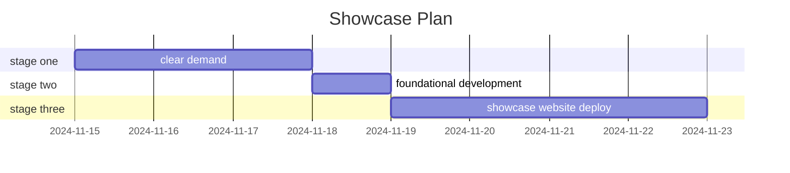

# hyperisland-test

## Run Eslint use: npm run lint

## All typography styles are in the typography.css file, chose the class you need and add them to your project in html files.

## Buttons
To use buttons, link `styles/buttons.css` and use buttons classes, the base class should always use
>>>>>>> 87ef82c18aae1fc74560bc19da3262f725c40d3f

